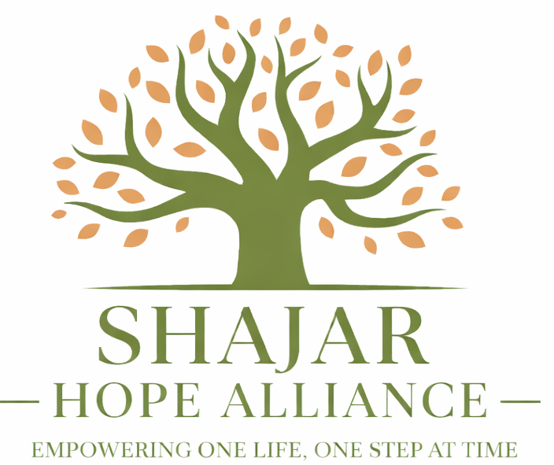

# 🌱 Shajar Hope Alliance



A modern, responsive NGO campaign management website built with HTML, Tailwind CSS, and vanilla JavaScript.

---

## 🔗 Links

- **Live Demo:** [GitHub Pages Link](#) *(deploy and update this link)*
- **Repository:** [GitHub Repository](#) *(update this link)*

---

## 📖 Project Overview

**Shajar Hope Alliance** is a centralized web platform connecting donors with students and communities in need. The platform empowers users to create, manage, search, and filter fundraising campaigns — all with a beautiful, responsive UI that supports dark/light mode.

---

## ✨ Key Features

- ✅ **5+ Responsive Web Pages** — Home, About, Contact, Sign In, Sign Up, Manage Campaigns
- ✅ **Consistent Navbar & Footer** — Uniform navigation with active page highlighting across all pages
- ✅ **CRUD Operations** — Create, Read, Update, and Delete campaigns with real-time DOM updates
- ✅ **Modal-Based Editing** — Professional edit modal instead of browser prompts
- ✅ **Search & Filter** — 10+ filter options using 8 array methods (`filter`, `map`, `sort`, `reduce`, `includes`, `find`, `every`, `some`)
- ✅ **Dark / Light Mode** — Theme toggle with `localStorage` persistence
- ✅ **Object CRUD Methods** — `Object.keys()`, `Object.values()`, `Object.entries()`, `Object.assign()`, `Object.freeze()`, `hasOwnProperty()`
- ✅ **14 String Methods** — `trim`, `toLowerCase`, `toUpperCase`, `includes`, `startsWith`, `endsWith`, `slice`, `replace`, `split`, `charAt`, `indexOf`, `concat`, `padStart`, `repeat`
- ✅ **ES6 Arrow Functions** — Used throughout the codebase
- ✅ **Modular Code Architecture** — Separate files for data, constants, utilities, and CRUD logic

---

## 🛠️ Technologies Used

| Technology | Purpose |
|------------|---------|
| **HTML5** | Page structure and semantic markup |
| **Tailwind CSS (CDN)** | Styling, responsive design, dark mode |
| **JavaScript (ES6+)** | DOM manipulation, CRUD, filters, theme toggle |
| **Google Fonts (Inter)** | Modern typography |
| **localStorage** | Theme preference persistence |

---

## 📁 Project Structure

```
NGO WEBSITE/
├── index.html                          # Home page
├── crud.html                           # CRUD / Manage Campaigns page
├── signin.html                         # Sign In page
├── signup.html                         # Sign Up page
├── README.md                           # Project documentation
│
├── assets/                             # Static assets folder
│
├── css/
│   └── style.css                       # Custom styles
│
├── img/
│   ├── hand.png.png                    # Navbar logo icon
│   ├── logo.png.png                    # Main logo / favicon
│   └── abouthand.png                   # About page image
│
└── src/
    ├── constants/
    │   └── themeConstants.js            # Theme configuration
    │
    ├── database/
    │   └── campaignData.js             # Campaign data (array of objects)
    │
    ├── utils/
    │   ├── themeUtils.js               # Dark/Light mode toggle
    │   ├── filterUtils.js              # Search & filter functions
    │   └── stringUtils.js              # String utility functions
    │
    ├── crud/
    │   └── crudOperations.js           # CRUD + Object methods
    │
    └── pages/
        ├── home/
        │   └── home.js                 # Home page rendering script
        ├── about/
        │   └── about.html              # About Us page
        └── contact/
            └── contact.html            # Contact Us page
```

---

## 🚀 How to Run the Project

1. **Clone the repository:**
   ```bash
   git clone https://github.com/your-username/ngo-website.git
   ```

2. **Navigate to the project folder:**
   ```bash
   cd ngo-website
   ```

3. **Open in browser:**
   - Simply open `index.html` in any modern web browser
   - Or use a local server like VS Code **Live Server** extension

4. **For Live Server (recommended):**
   - Install the "Live Server" extension in VS Code
   - Right-click `index.html` → "Open with Live Server"
   - The site will be available at `http://127.0.0.1:5500`

---

## 📸 Screenshots

*(Add screenshots of your project pages here)*

### Home Page
> Screenshot of the home page with campaign cards and filters

### Manage Campaigns (CRUD)
> Screenshot of the CRUD page with add form, campaign grid, and edit modal

### Dark Mode
> Screenshot showing the dark theme across pages

### About Us
> Screenshot of the about page with timeline and team sections

### Contact Us
> Screenshot of the contact form and info cards

---

## 👩‍💻 Author

**Ayesha Masood**

---

© 2026 Shajar Hope Alliance. All rights reserved.
